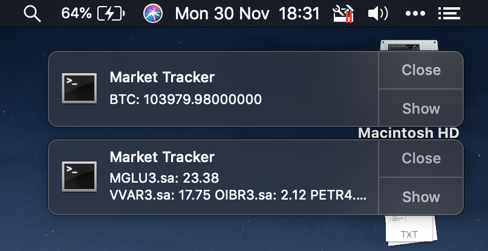
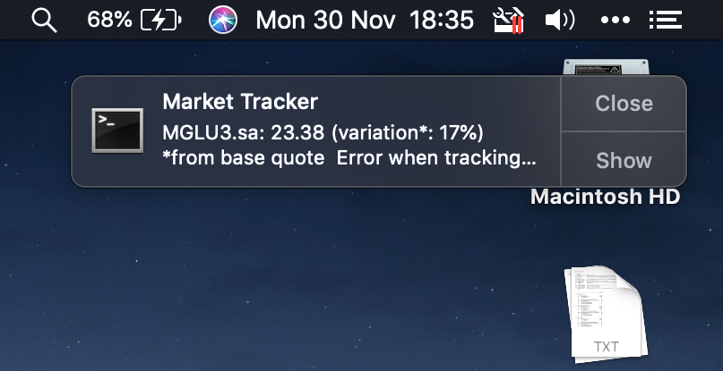
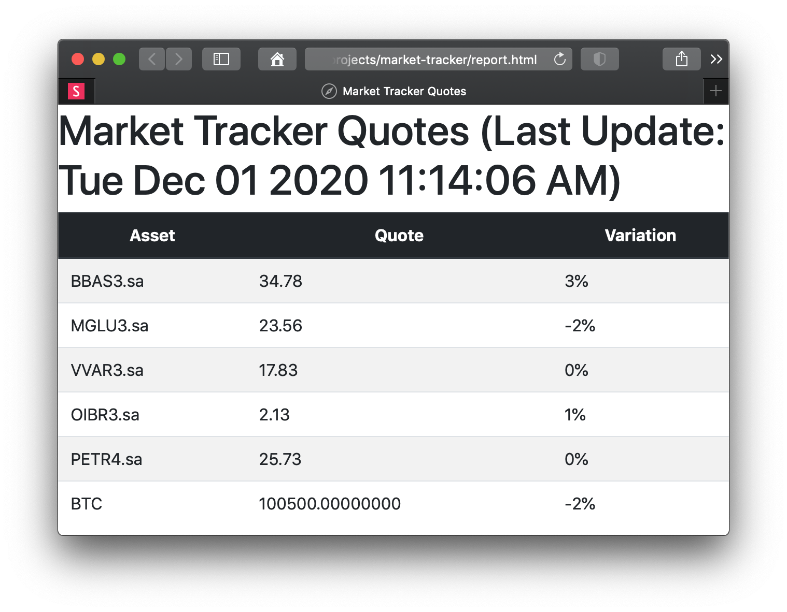

# Market Tracker

| Starting up  | Asset quote change  |
|---|---|
|  |  |

A Node.js console application to track market assets,
currently including stocks and cryptocurrencies.
It works for Windows, Linux and macOS.

It uses Yahoo Finance data for stocks.
**This way, the app cannot be used for commercial porpuses.**
The API from the brazilian exchange [Mercado Bitcoin](https://www.mercadobitcoin.com.br/api-doc/) is used for cryptocurrencies.

A `report.html` file is generated into the project directory and can be accessed by clicking
the notification.




## 1. Requirements

You just need at least [Node.js 15](http://nodejs.org) installed.

## 2. Download

You can download the source code to run the app in two different ways:

### 2.1 Using git

You can clone the project using the following command:

```bash
git clone https://github.com/manoelcampos/market-tracker.git
```

### 2.2 Geting a zip file

You can simply download it as a [zip file here](https://github.com/manoelcampos/market-tracker/archive/master.zip).


## 3. Install and run

```bash
# Install dependencies
npm install

# Start the server
npm start &
```

The terminal shows how to open the application in the browser.
By default, the address is http://localhost:8080

## 4. Configuration

After you start the server, a `config.json` file is created based on
[config.json.dist](config.json.dist). Change the configuration as you wish.
When you update the config file and save, it's reloaded automatically.

## 5. License

This project is intended for non-commercial use and is protected by the [Creative Commons Attribution-NonCommercial-ShareAlike 4.0 International License](LICENSE).