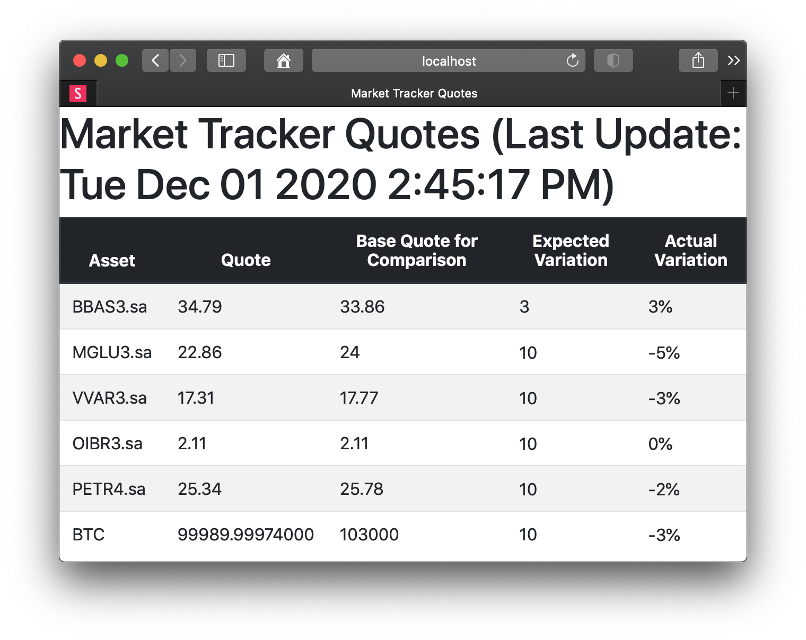

# Market Tracker

| Starting up  | Asset quote change  |
|---|---|
|  |  |

A Node.js console application to track market assets,
currently including stocks and cryptocurrencies.
It works for Windows, Linux and macOS.

It uses Yahoo Finance data for stocks.
**This way, the app cannot be used for commercial porpuses.**
The API from the brazilian exchange [Mercado Bitcoin](https://www.mercadobitcoin.com.br/api-doc/) is used for cryptocurrencies.

A `report.html` file is generated into the project directory and can be accessed by clicking
the notification.




## 1. Requirements

You just need [Node.js 15](http://nodejs.org) installed.

## 2. Download

### 2.1 Using git

You can clone the project using the following command:

```bash
git clone https://github.com/manoelcampos/market-tracker.git
```

This way, you can update the sources just using:

```bash
git pull
```

### 2.2 Geting a zip file

You can simply download it as a [zip file here](https://github.com/manoelcampos/market-tracker/archive/master.zip).


## 3. Install and run

```bash
# Install dependencies
npm install

# Run the app in background
npm start &
```

The terminal shows how to open the application in the browser.
By default, the address is http://localhost:8080

## 4. Configuration

The [config.json](config.json.dist) file has the following structure that is explained
below.

```javascript
{
    //Service port, to enable acccess to http://localhost:8080
    "port": 8080,

    //Timer interval (in seconds) to check for assets quotes variation.
    "trackIntervalSecs": 1800,
    
    /*Whether show a notification when no expected variation 
    occurs in any of your assets*/ 
    "notifyWhenNoExpectedVariation": false,

    /*Default percentage (between [0..100%]) of variation (up or down) 
    that one of your assets should have so you are notified. 
    If an asset doesn't have it own configuration for this parameter,
    this value is used instead.*/
    "defaultExpectedPercentVariation": 10.0,

    /* List of stocks you want to track. 
    Add a new entry for each stock. */
    "stocks": [
        {
            /* Ticker of the stock you want to track 
            (for Brazilian stocks, you need to add .sa suffix).*/
            "ticker": "MGLU3.sa",

            /* The base value you want to compare the current stock quote with.
            This way, if there is the desired variation on the stock quote,
            you will be notified.*/
            "baseQuote": 20.00
        },
        {
            "ticker": "VVAR3.sa",

            /*Percentage (between [0..100%]) of variation (up or down) 
            that this particular stock should have so you are notified. 
            If the stock doesn't have this configuration,
            the defaultExpectedPercentVariation is used instead.*/
            "expectedPercentVariation": 15.0,

            "baseQuote": 15.00
        }
    ],

    /* List of cryptocurrencies you want to track. 
    Add a new entry for each crypto. */
    "cryptos": [
        {
            "ticker": "BTC",
            "baseQuote": 103000
        }
    ]
}
```

When you update the config file and save, it's reloaded automatically.


## 5. License

This project is intended for non-commercial use and is protected by the [Creative Commons Attribution-NonCommercial-ShareAlike 4.0 International License](LICENSE).